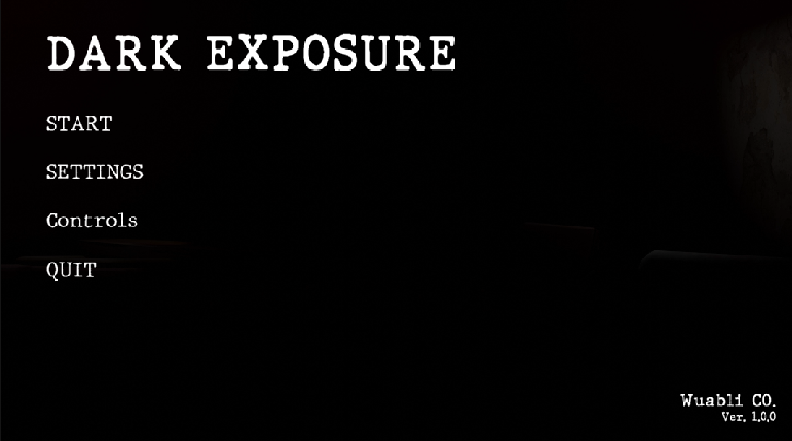
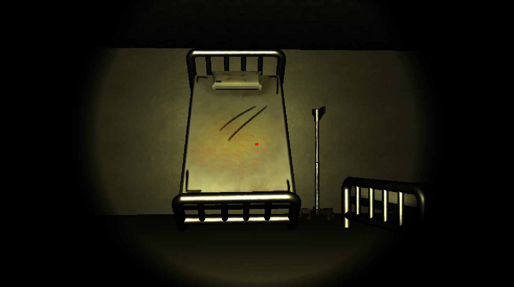
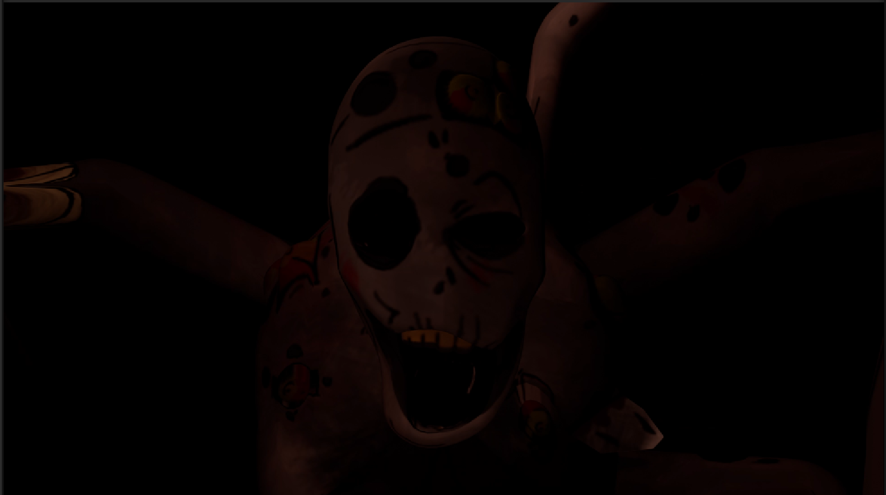
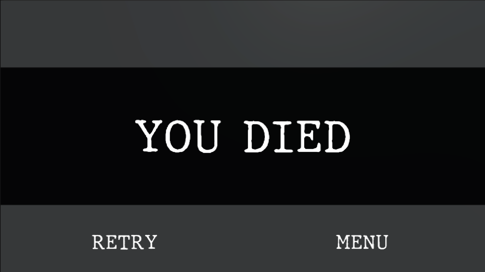

# Dark Exposure

Dark exposure es un video juego del genero de terror estilo semirealista 3D donde jugaras el papel de un detective que se embarca dentro de un hospital abandonado donde te encontraras con una criatura monstruosa que solo podras ver a traves de una camara.

##  Características

-  Enemigo con IA semiavanzada con patrones de movimiento.
-  Busqueda de objetos
-  Sistema de inventario 
-  Sonido 3D dentro del juego

##  Tecnologías utilizadas

- Unity 3D
- C#
- MAYA
- After Effects

## Capturas de pantalla

<p align="center">
  
  
  
  
  
  
  
</p>

##  Cómo ejecutar el proyecto

1. Clona el repositorio:
```bash
https://github.com/CapitanPulido/Shadows/tree/a28bb63546298d3e5cbb099ca45a061ee11f4c70
